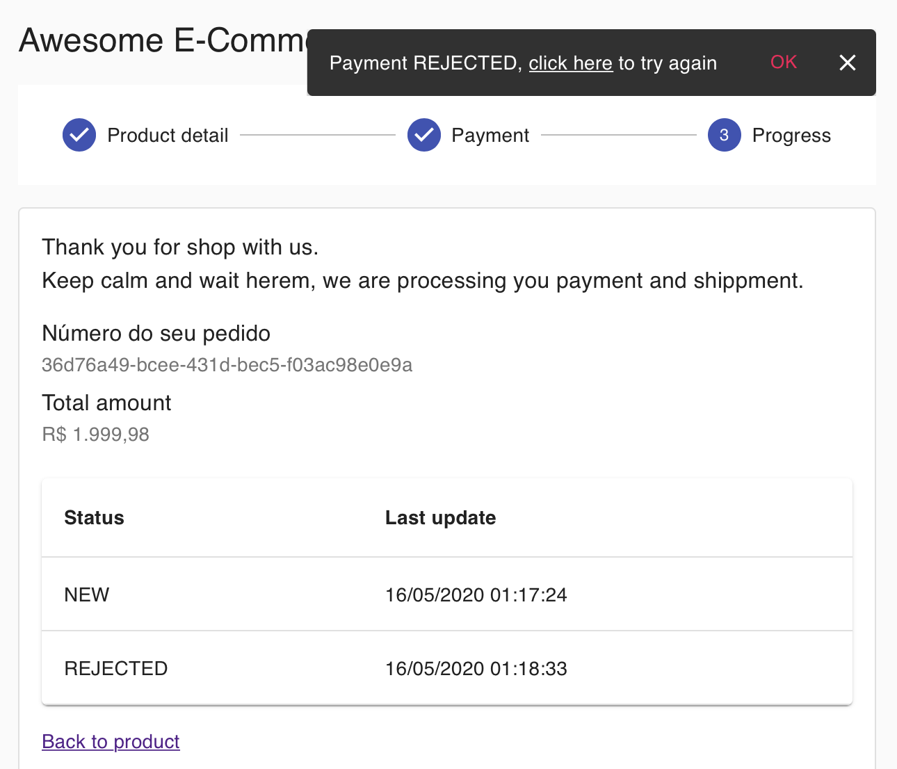
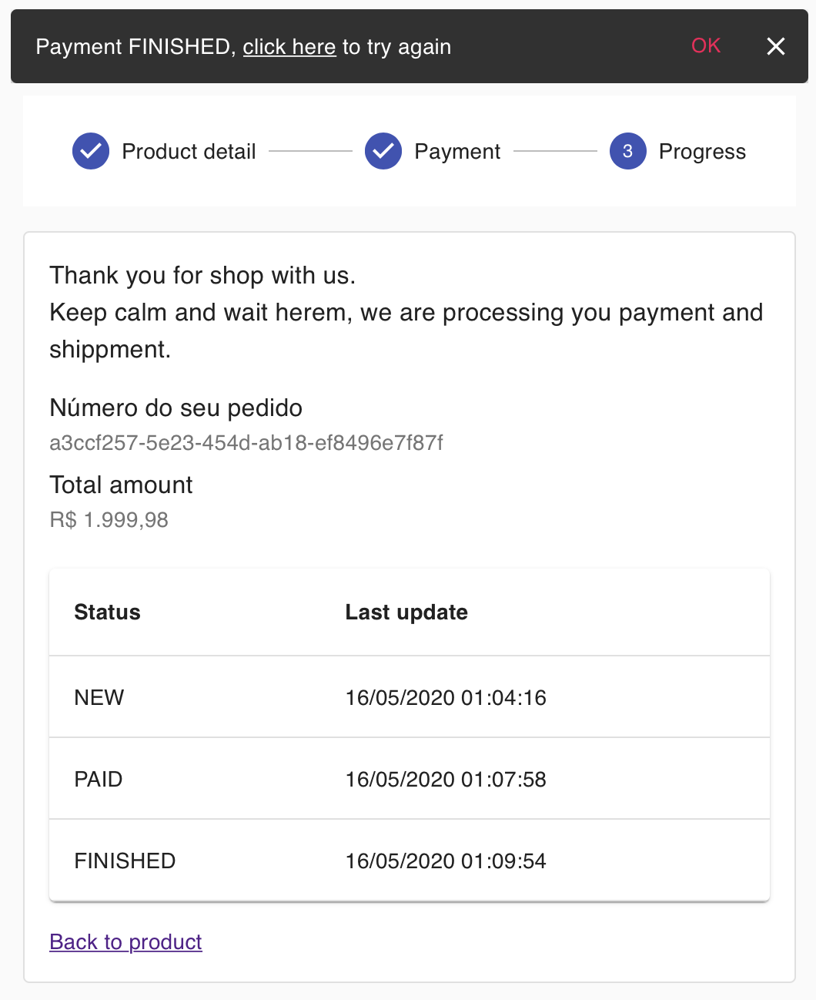

# DevOps Test VixCommerce

A sample project to demonstrate the tools power to building a real microservice platform with fully managed docker, serverless, CICD, IaaC, message queues, GraphQL and PubSub.

## Tools used:

### IaaC

- Hashcorp Terraform

- AWS CloudFormation

- AWS Serverless Application Model (SAM)

### AWS Infrastructure

- ECS - Elastic Container Service (Fargate)

- ALB - Application Load Balancer

- API Gateway

- Lambda

- DynamoDB

- Elasticache - Redis

- SQS - Simple Queue Service

- Step Functions

- Code Build / Code Pipeline / Code Deploy

- Amplify

- CloudFront

- S3 - Simple Storage Service

- SES - Simple Email Service

- SNS - Simple Notification Service

- Route 53

- ACM - Amazon Certification Manager

- AWS-Vault

### Backend

- Apollo Server

- Express

- NodeJS 12

- SQS Consumer

- Docker

- Yarn

### Frontend

- ReactJS

- ApolloClient

- Material UI

- Yarn

# Architecture

## Platform

All infrastucture have benn built in IaaS. Using Terraform, CloudFormation and SAM.


## Continuous Deployment

Using GitFlow:

- Merge in master branch starts deployment at production account.

- Merge in develop branch start deployment at staging account (No deployed do KISS).


# Running Local

## Authentication

```
# Using AWS-Vault cli
$aws-vault exec <profile-name> -s -d 12h

# Using AWS-Cli
$ aws configure
# Select options
```

## Backend

Services:

- GraphQL API and Playground: http://localhost:4000

- WebSocket Service: ws://localhost:4000/graphql

- SQS Background Worker

### GraphQL API

```
# Installation
$ brew install yarn

# Requires Authentication and Redis

$ cd api
$ source .env
$ yarn
$ yarn start
```

### Sells Service

Endpoint: http://localhost:3000/v1

```
# Installation
$ brew tap aws/tap
$ brew install aws-sam-cli

# Requires Authentication

$ cd sells-service
$ am local start-api
```

### Redis

```
# Installation
$ brew install redis

# Initialization
$ redis-server
```

## Frontend

Endpoint: http://localhost:5000

```
$ cd frontend
$ source .env
$ yarn
$ yarn start
```

## Running at Cloud

Frontend: https://www.vixcommerce.com.br

The checkout have been built with asyncronous architecture, therefore two actions to execute out of the app.

1. Payment: It's posted to the mock gateway url and the app wait a postback to notify the customer and proceed to shipment

1. Shipment: It's posted to the mock courier url and the app wait a postback to notify the customer that the product were received

1. The workflow it's managed by AWS Step Functions, explained above

1. All data it's load from websocket, you don't need refrash the page

### The URLs:

#### Payment:

- Gateway: https://denilson.free.beeceptor.com/v1/payment
- Postback: https://sells-service.vixcommerce.com.br/v1/shipment/confirmation

#### Shipment

- Gateway: https://denilson.free.beeceptor.com/v1/shipment
- Postback: https://sells-service.vixcommerce.com.br/v1/shipment/confirmation

## Screens and Sale Workflow

Before show the screens, it's time to present AWS Step Function, with it you can manage workflow without manage the transitions. See more on AWS docs.

### Product page

https://www.vixcommerce.com.br


### Payment page

https://www.vixcommerce.com.br/payment/:id


### Order page

https://www.vixcommerce.com.br/order/:id


### Beeceptor gateway post page

https://beeceptor.com/console/denilson


### ReqBin postback payment page

To confirm payment, set payload field status equals PAID ou REJECTED to cancel the order.


https://reqbin.com


### Confirm payment page

https://www.vixcommerce.com.br/order/:id


### Rejected payment page

https://www.vixcommerce.com.br/order/:id



Payment rejected with payment denied


Payment rejected with timeout


### Beeceptor shipment post page

https://beeceptor.com/console/denilson


### ReqBin postback shipment page

https://reqbin.com


### Confirm payment page

https://www.vixcommerce.com.br/order/:id




Backend: https://api.vixcommerce.com.br

### GraphQL Queries, Mutations and Subscriptions

```
query ListOrders {
  listOrders {
    items {
      id
      value
      status
      createdAt
      updatedAt
      updateLogs
    }
    nextToken
    total
  }
}

query GetOrder($id: ID!) {
  getOrder(id: $id) {
    id
    value
    status
    createdAt
    updatedAt
    updateLogs
  }
}

mutation CreateOrder($input: CreateOrderInput!) {
  createOrder(input: $input) {
    id
    value
    status
    createdAt
    updatedAt
    updateLogs
  }
}

mutation UpdateOrder($input: UpdateOrderInput!) {
  updateOrder(input: $input) {
    id
    value
    status
    createdAt
    updatedAt
    updateLogs
  }
}

mutation PayOrder($input: PayOrderInput!) {
  payOrder(input: $input)
}

subscription OnCreateOrder {
  onCreateOrder {
    id
    value
    status
    createdAt
    updatedAt
    updateLogs
  }
}

subscription OnUpdateOrder {
  onUpdateOrder {
    id
    value
    status
    createdAt
    updatedAt
    updateLogs
  }
}
```

# Deploy

## sells-service

- Github Token Env var

## backend

- Github Token Parameter

# Test

- abrir o beeceptor https://beeceptor.com/console/denilson
- postar no https://reqbin.com
