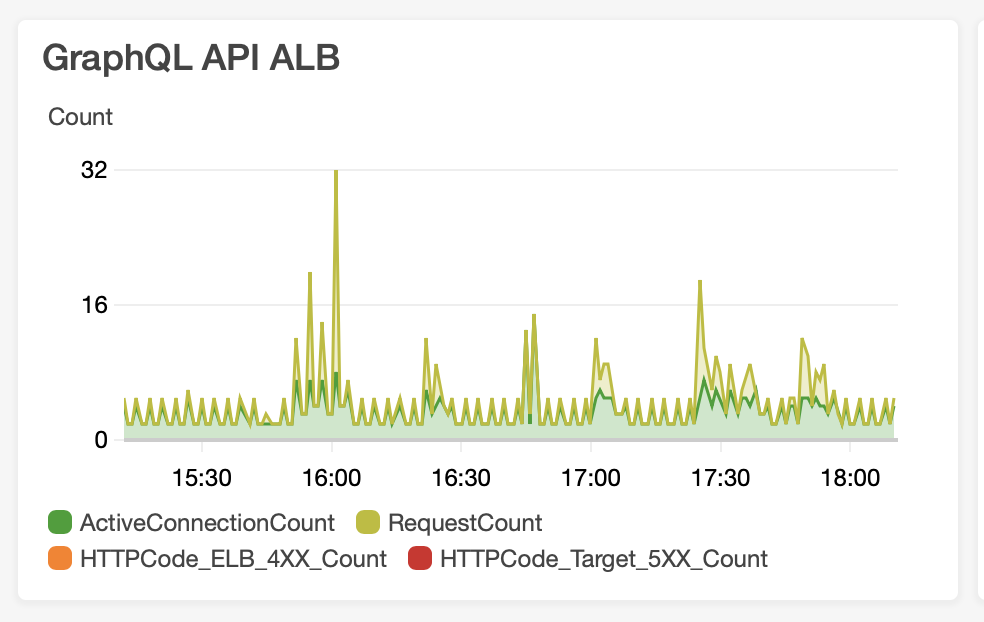
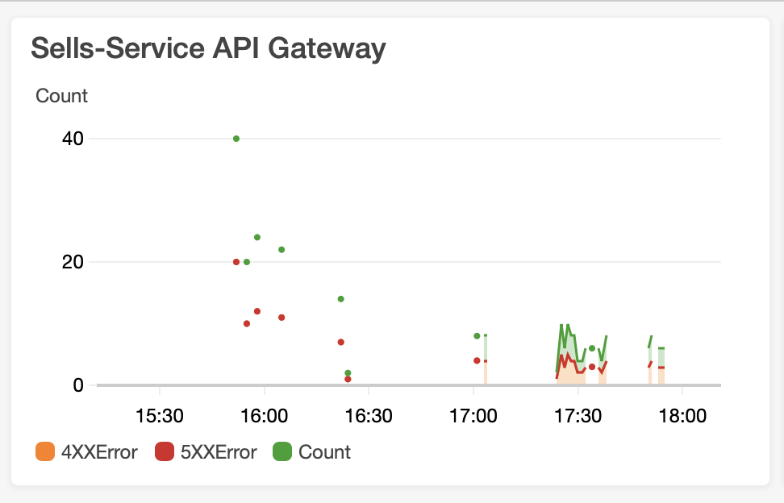
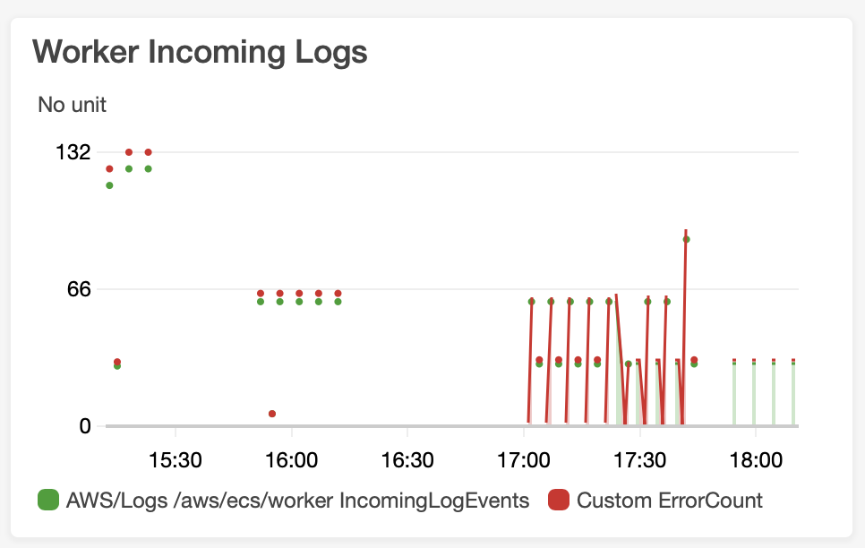
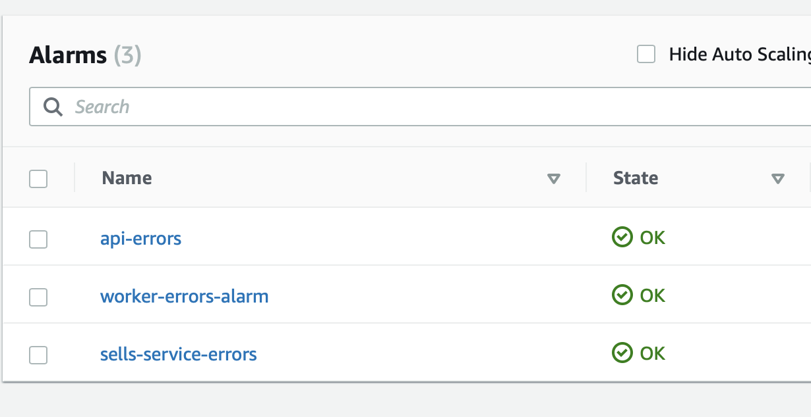
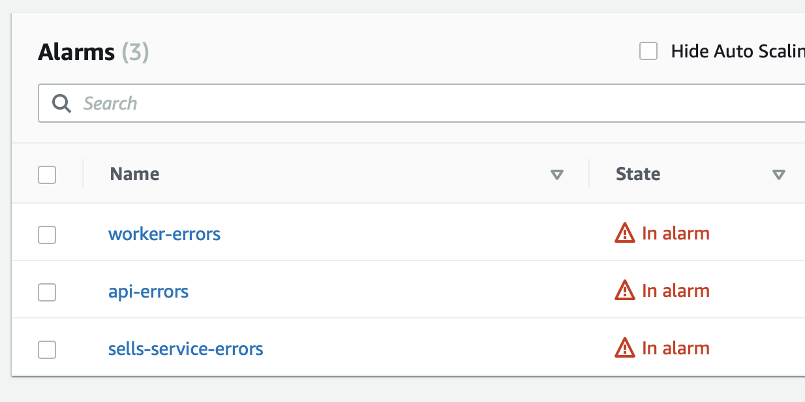
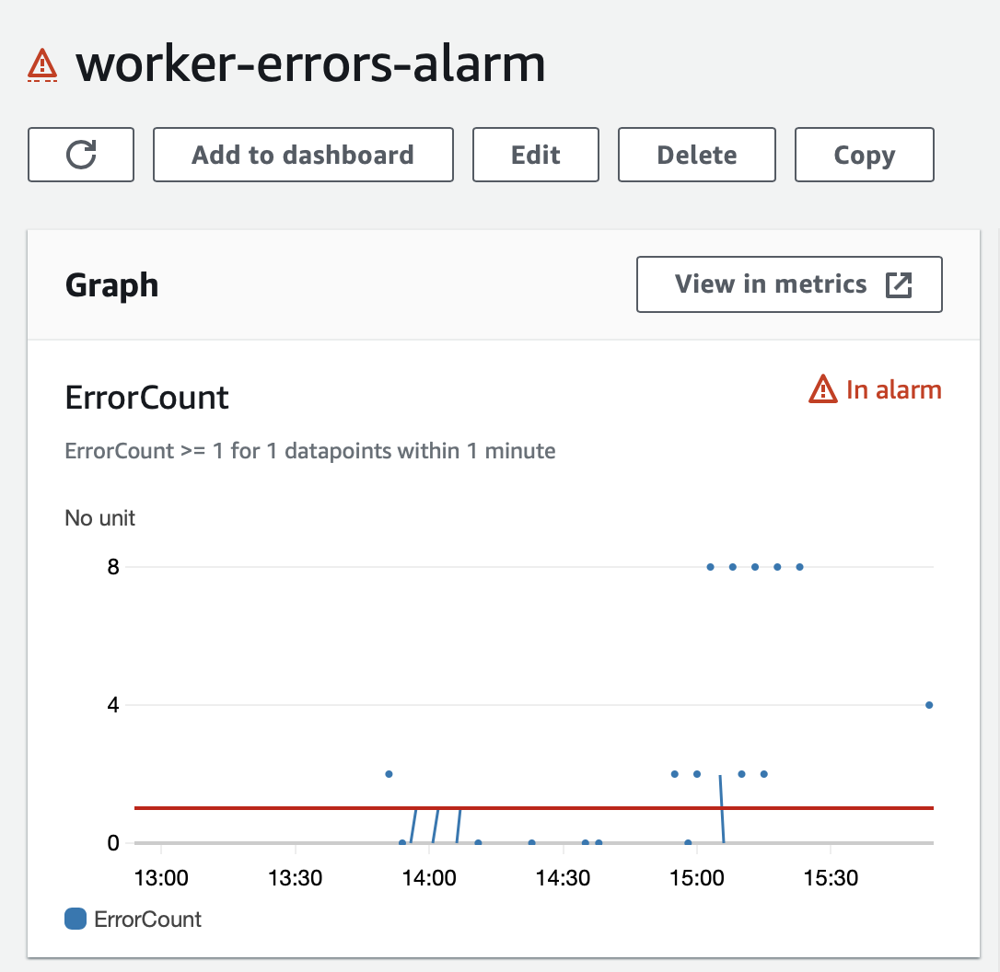

## Documentation

[Home](../README.md)

[Arquitecture](architecture.md)

[Using](using.md)

[Screens](screens.md)

[GraphQL API](graphql.md)

**Observability and Monitoring**

[Roadmap](roadmap.md)

## Observability and Monitoring

## Dashboard

Charts with services health and errors count.

## Alarms

Monitoring erros on services and sending an email on failures

[Next page](roadmap.md)
