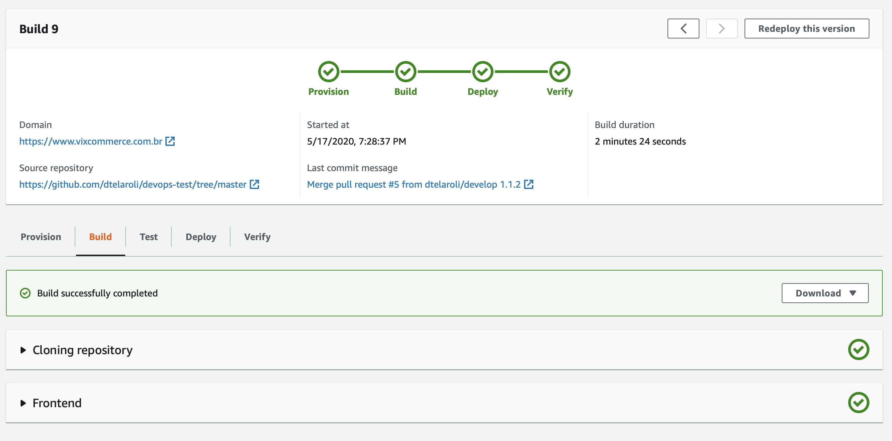
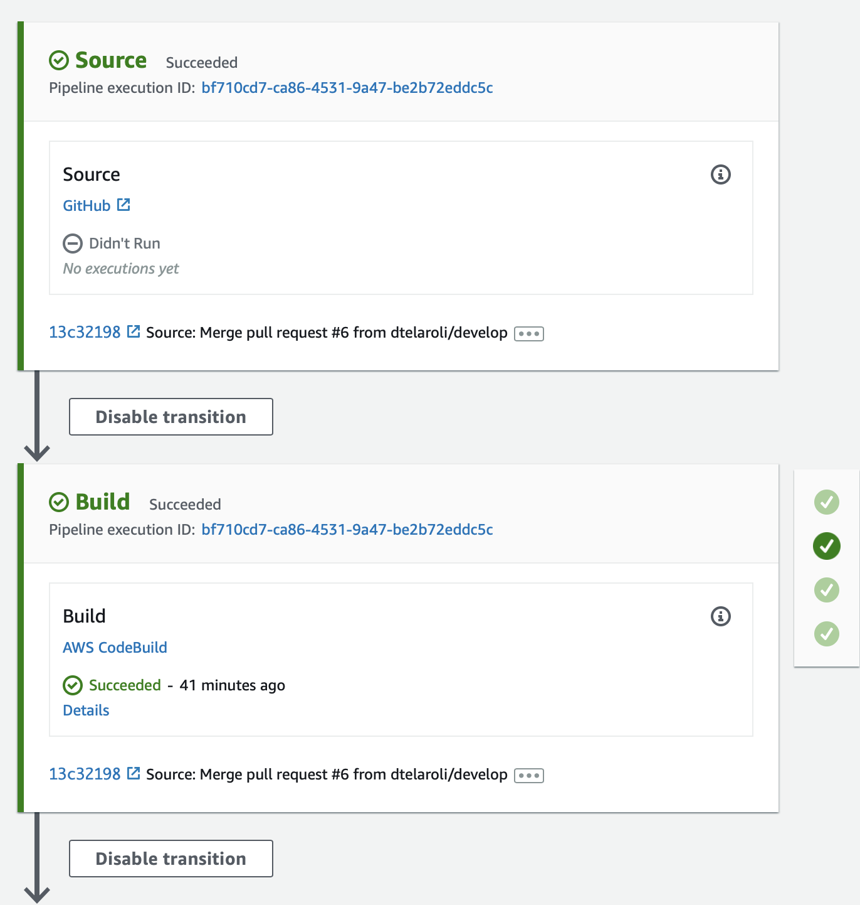
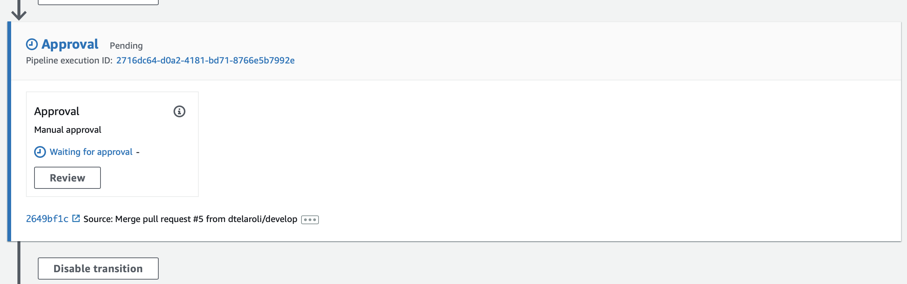

# Documentation

1. [Home](../README.md)
1. [Architecture](architecture.md)
2. Pipelines
3. [Using](using.md)
4. [Screens](screens.md)
5. [GraphQL API](graphql.md)
6. [Observability and Monitoring](monitoring.md)
7. [Roadmap](roadmap.md)

# Pipelines

## Frontend

### Amplify

## Backend

### CodePipeline

### Manual Approval

[Next page](using.md)
