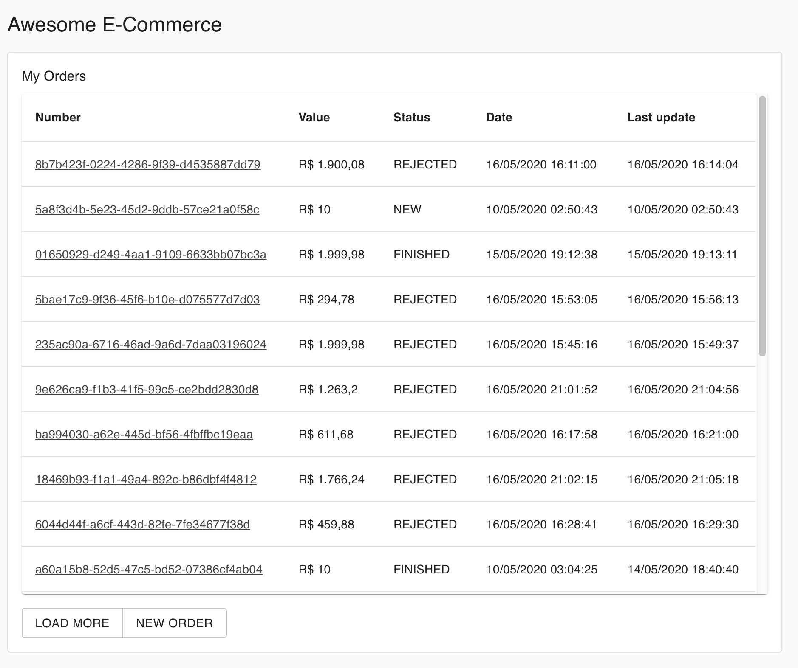
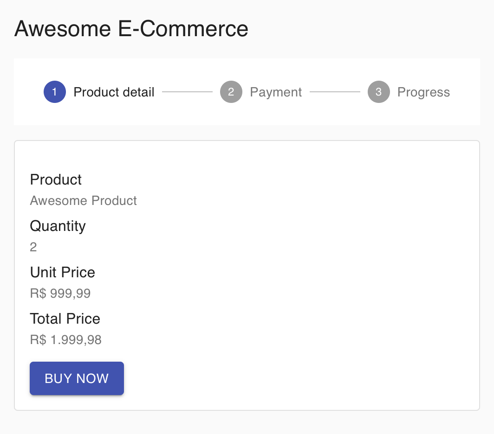
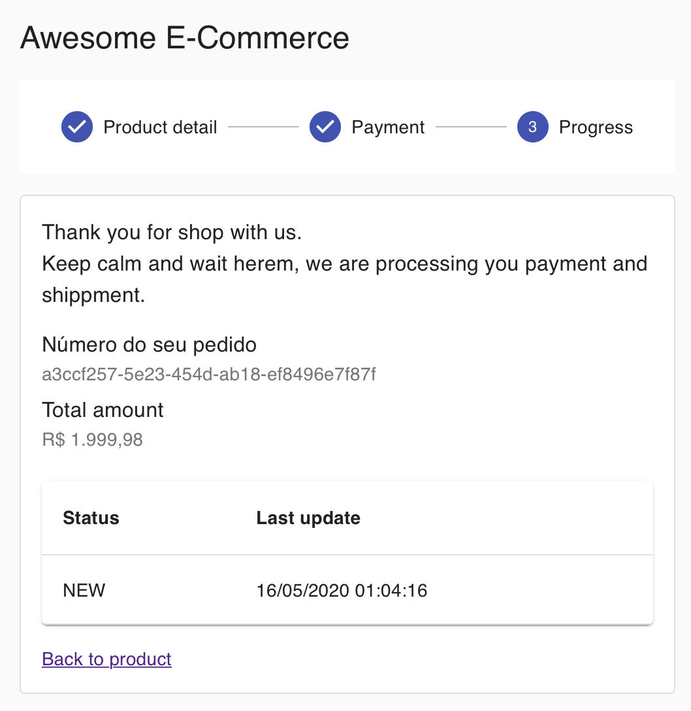
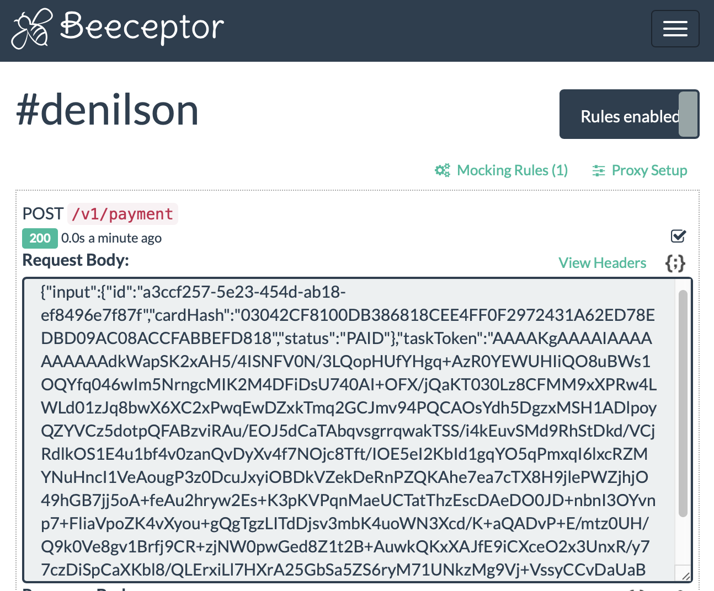
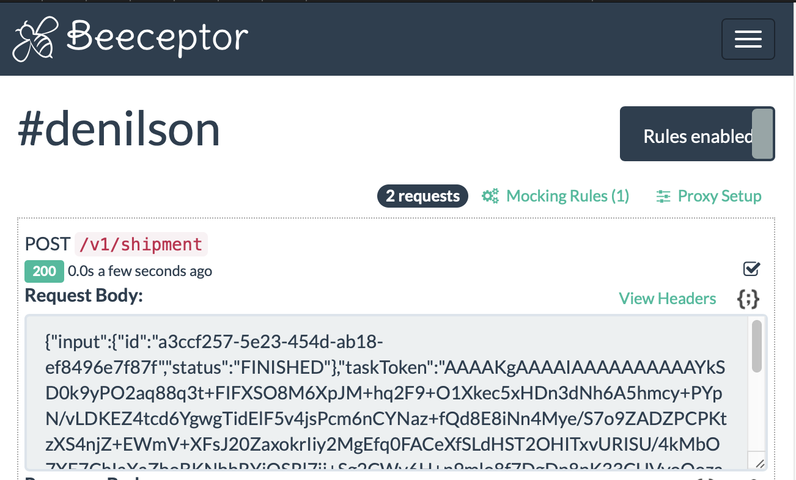
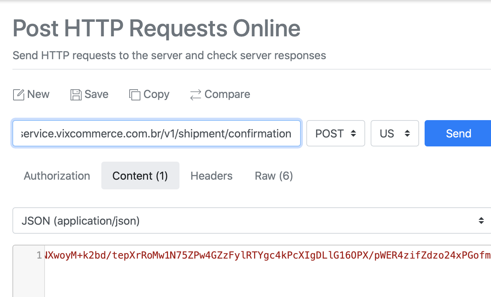
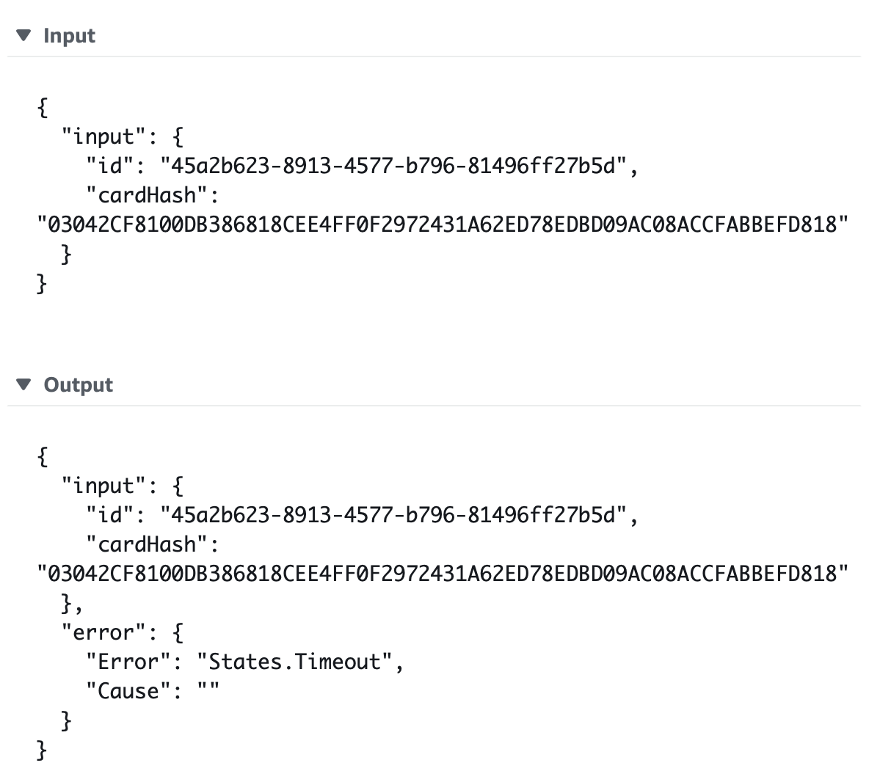

## Screens and Sale Workflow

Before show the screens, it's time to present AWS Step Function, with it you can manage workflows without manage the state transitions. See more on AWS docs.

## Orders

https://www.vixcommerce.com.br

### Checkout page

https://www.vixcommerce.com.br/checkout

### Payment page

https://www.vixcommerce.com.br/checkout/payment

### Order page

https://www.vixcommerce.com.br/checkout/order

### Beeceptor gateway post page and ReqBin postback

After order confirmation, the platform start a Step Function execution. The first step it's send the payment request to Gateway API (mocked by Beeceptor).

https://beeceptor.com/console/denilson

  
  

To confirm payment, set payload field status equals PAID or REJECTED to approve or cancel the order. Sending the request with ReqBin, the app wil be notified and show the payment confirmation.

https://reqbin.com
https://www.vixcommerce.com.br/order/:id

  
  

### Rejected payment page

The payment can be rejected by timeout, if it does not receive the postback in 240 seconds or when gateway returns status REJECTED or CANCELED.

https://www.vixcommerce.com.br/order/:id

  
  

### Shipment Postback

After payment confirmation, the Step Functions sent a shipment request (mocked in Beeceptor) and wait a postback shipping confirmation.

  
  

### Confirm payment page

https://www.vixcommerce.com.br/order/:id

  
  

### Logs and Errors

The Step Functions logs all inputs, outputs and exceptions.

  
  

[Next Page](graphql.md)

# Documentation

[Home](../README.md)

[Arquitecture](architecture.md)

[Using](using.md)

**Screens**

[GraphQL API](graphql.md)
